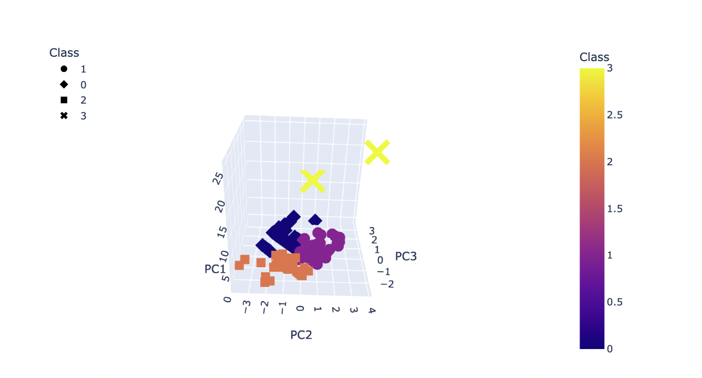
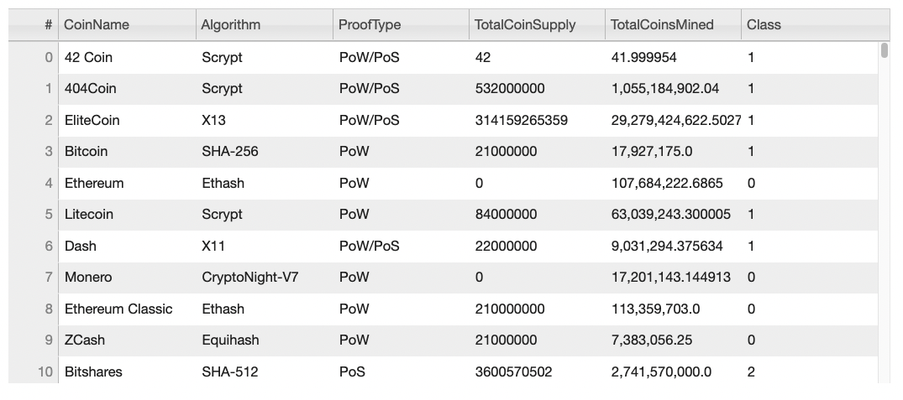
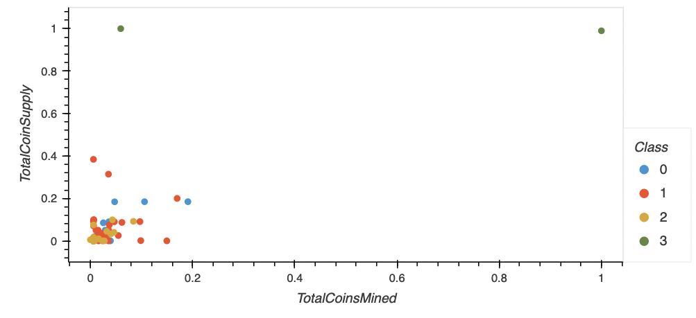

# Cryptocurrencies

## Overview
The goal of this project was to apply unsupervised machine learning (K-means algorithm) to Cryptocurreny data to identify clusters and patterns regarding the hunderds of currency being traded today. To accomplish this, I performed the following tasks:

1. Performed preprocessing of the cryptocurrency data for PCA and ML analysis
    - Filtered data to only include crypto that is actively traded and has coins that have been mined. 
    - Removed rows with null values and columns with data that are unnecessary for PCA and ML.
    - Encoded non-numeric data 
    - Scaled the data for additional analysis using StandardScaler

2. Reduced dimensions of the data using PCA
    - Reduced the number of components from 4 to 3

3. Clustered cryptocurrencies using K-means
    - Created an elbow curve to determine the best value for K
    - Applied K-means algorithm to principal components
    - Generated predictions
    - Prepared a new dataframe with relevant information for data vizualization

4. Vizualized cryptocurrency clustering results
    - Created a 3D-scatter plot with PCA data and the clusters
    
    - Created interactive table with tradeable currencies and corresponding classes
    
    - Created a 2D-scatter plot of Total Coins Mined vs Total Coin Supplied.
     

    ## Resources
    [ccJupyter](crypto_clustering.ipynb) Jupyter Notebook with the code used for this project. 

    [ccData](Resources/crypto_data.csv) Contains the data used for this specific analysis. This data was retrieved from CryptoCompare (https://min-api.cryptocompare.com/data/all/coinlist).